Installationshjälp för Arduino-utvecklingsmiljön
===
Skrivet av SA5MOG, Magnus Öberg. 2020-02-08

Steg-för-steg-instruktioner
--

Det första du behöver göra är att installera Arduino-utvecklingsmiljön
på din PC. Den här hjälpguiden är skriven främst för Windows, men Arduino
finns även till Linux och Mac OS X.

Installation av utvecklingsmiljön för Linux och Mac är inte beskrivet i
denna hjälpguide. Linux har olika sätt att hantera mjukvarupaket beroende
på distribution. Finns det en Arduino inbyggt kan den vara för gammal och
kräva att en nyare version installeras manuellt. Anvisningarna i denna guide
för DotStar-biblioteket och installation av support för Adafruit-hårdvarorna
är däremot användbara även för Linux och Mac.

Du behöver ha en nyare version av Arduino-utvecklingsmiljön, version 1.8 eller senare.

Observera att du bara behöver installera Arduino-utvecklingsmiljön för att
kunna programmera Trinket M0.
 **Du behöver inte köpa ett fysiskt Arduino-kort!**

Om du inte har mjukvaran redan installerat, öppna din browser och gå till
**arduino.cc**

Gå in på menyn **Software** och välj **Downloads**

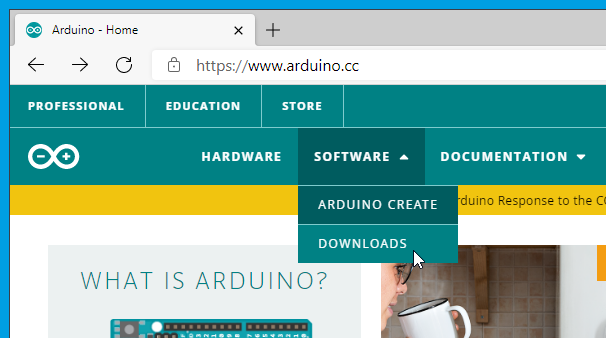

En lista med varianter för olika operativsystem visas, hitta den som passar
din dator och klicka på den länken

Du får en möjlighet att bidra med pengar till projektet, gör det eller skippa
och gå förbi genom att klicka **Just download**

Klicka **Open file** när filen är nedladdad, eller öppna upp den folder du
har nedladdningar i och dubbelklicka på den fil du just fick hem.

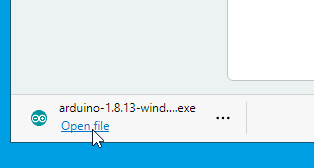

Du kan få en popup, en sk. *User Account Control*. Tillåt att programmet
gör förändringar på din dator, klicka **yes**.

Godkänn licensvillkoren för GNU Lesser General Public License.

De förvalda komponenterna är OK, klicka **Next &gt;**

Du får möjlighet att välja var programvaran ska installeras.
Det förvalda är OK för de flesta fall, klicka **Install**

Installationen kan ta några minuter.

Du kan få en popup med frågan om du vill installera en "device"-mjukvara
från *Adafruit Industries LLC Ports*. Se till att kryssrutan är bockad för *Always trust software from "Adafruit Industries"*. Klicka **Install**

Installera också *Arduino USB Driver* om den frågar, och lita på mjukvara från *Arduino srl*. Klicka **Install**

Det kan hända att du får frågan om "Arduino USB Driver" en gång till. Det är normalt, klicka vidare med **Install** igen.

Klicka **Close** när den är klar.

Du ska nu ha fått en ny ikon på skrivbordet: *Arduino*. Den finns även inlagd i startmenyn. Öppna upp programmet med dubbelklick på ikonen eller via startmenyn.

Fösta gången du kör programmet kommer du behöva tillåta att *Java(TM) Platform SE* ska få åtkomst till nätverket genom windows brandvägg.
Klicka på *Allow access*

När miljön startar visas ett exempelprogram.

En del extra programmoduler krävs för att få igång stödet för Adafruit Trinket M0.

**Följande steg är även applicerbara för Linux och Mac OS X!**

Klicka på menyraden *Tools* och *Manage Libraries...*

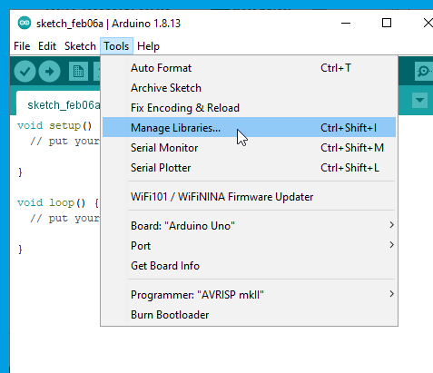

Skriv in detta i sökfältet: **dotstar led**

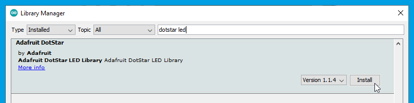

Du ska få en match för *Adafruit DotStar*-biblioteket, klicka **Install** för den.

Stäng med **Close** när det är klart.

Det krävs även programstöd för själva hårdvaran Trinket M0. I menyraden *File*, välj *Preferences*

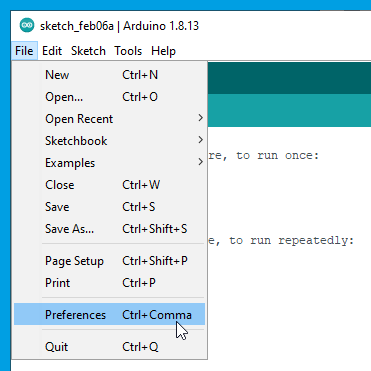

I den nedre delen av detta fönster finns ett fält för *Additional Boards Manager URLs*

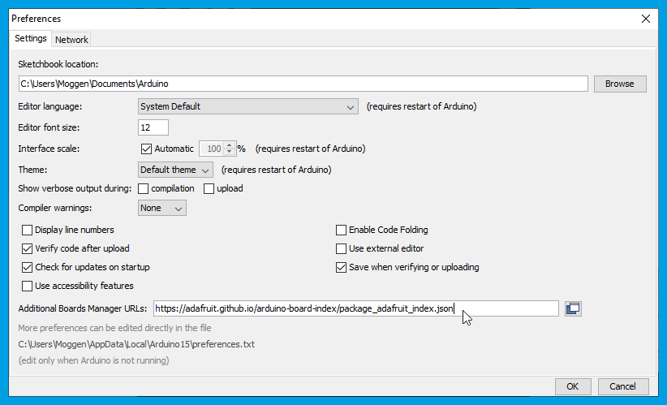

Här behöver du skriva eller kopiera in denna exakta URL: 
https://adafruit.github.io/arduino-board-index/package_adafruit_index.json

Klicka **OK**

Gå till menyraden *Tools* och *Board: Arduino Uno*. Det kan hända att det
står nåt annat här men det är det valet som börjar med texten: *Board:*

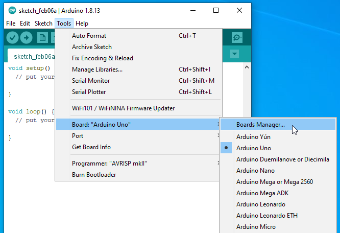

En lista med massa olika utvecklingskort visas här, välj det översta alternativet *Boards Manager...*

"Boards Manager" öppnas. Skriv detta i sökfältet: **trinket m0**

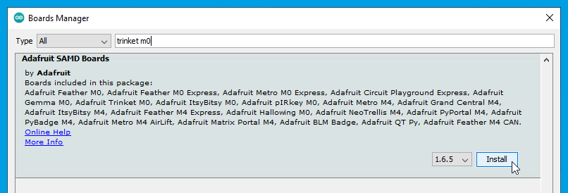

Du ska få upp en modul som heter *Adafruit SAMD Boards*, klicka på **Install** på detta.

Nu laddas filer och extra mjukvara hem för att kunna programmera Trinket M0 och andra utvecklingskort. Detta kan ta en stund.

Avsluta när det är klart med **Close**

Nu behöver du välja Trinket M0 som aktuellt utvecklingskort.
Gå till menyraden *Tools*, och det val som börjar med texten *Board:*

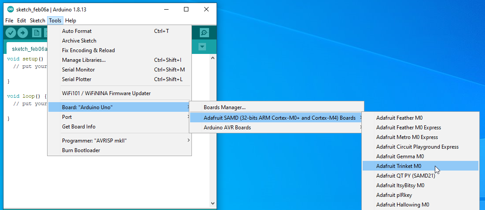

Den här gången kommer det upp en kategori för *Adafruit SAMD*, och under den kan man hitta *Adafruit Trinket M0*. Välj den.

Nu är Arduino-utvecklingsmiljön redo för att programmera en Trinket M0!

Plugga in din Trinket M0 i datorn via en micro-USB-kabel

Kortet kommer att dyka upp som en serieenhet på datorn. Gå till menyraden *Tools* och *Port* och se vad enheten fick för namn. Välj den.

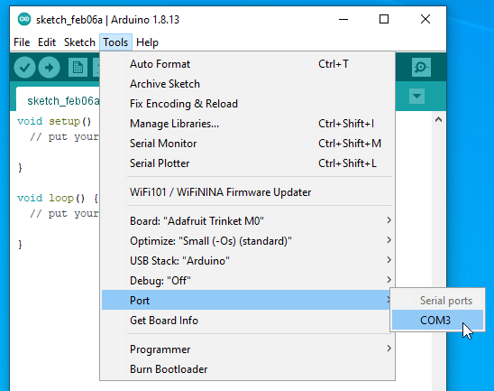

På min dator dök den upp som *COM3* men det kan ha blivit något annat namn på din dator. (Linux har andra namnkonventioner för sina enheter, t.ex. */dev/ttyACM0*)

Det utvecklingskort och port som är valt kan alltid ses i nedre högra hörnet på fönstret.

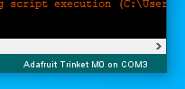

Nu är det dags att hämta hem filterprogrammet! Skriv eller kopiera den här adressen till din browser: 
https://raw.githubusercontent.com/moggen/m0_filter/main/m0_filter.ino

Nu kan du se källkoden till programmet. Högerklicka på texten och välj: *Save As* , *Save Page As* eller liknande för att spara innehållet som en fil på hårddisken.

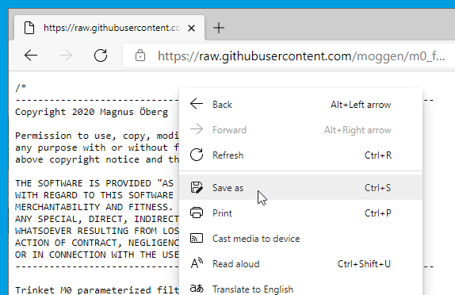

Du kan spara filen var du vill, men ett tips för Windows är att lägga filen i katalogen *Documents\Arduino*

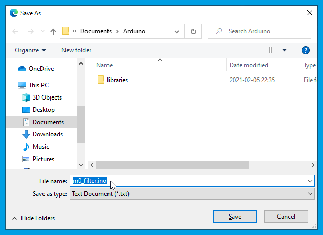

**Viktigt**: Se till att namnge filen du sparar som *m0_filter.ino* UTAN eventuella extra tillägg som browsern lägger till. Tex. kan *.txt* läggas på, och det ska vi inte ha med.

Gå tillbaka till Arduino-fönstret och välj i menyraden *File* och *Open*.
Gå till den folder du sparade filen i (*Documents\Arduino*).
Välj *m0_filter.ino* och klicka **Open**

Det kommer att poppa upp en fråga om filen ska flyttas in i en egen folder med samma namn. Du behöver klicka **OK** här

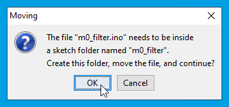

Nu är programkoden inladdad i editeringsfönstret.

Klicka på den cirkulära ikonen i övre delen av fönstret med en pil som pekar åt höger. Detta är uppladdningsfunktionen som utför kompilering och uppladdning till Trinket M0-kortet.

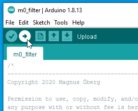

Om uppladdningen fastnar och får en time-out kan du prova att trycka till en gång på den lilla reset-knappen på Trinket-kortet. Klicka på upload igen efter det. Det kan också hjälpa att dra ur USB och sätta i igen och försöka med upload igen.

Det händer också ibland att det lilla kortet får ett annat portnamn, speciellt när man tryckt på resetknappen.
Kolla under *Tools* och *Port:* om den har fått nåt annat namn. Välj det nya och prova igen med upload.

När du ser *Done uploading* i statusfältet så är att klart och Trinket kör sitt nya program.

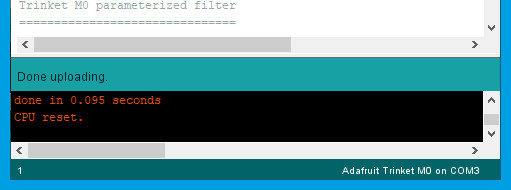

Koppla in ljudet och vrid på potentiometrarna för att höra hur filtret fungerar!

USB-kabeln behöver inte vara inkopplad längre om du har en annan strömkälla inkopplad, tex. batterier.

*73 och ha så skoj!*
