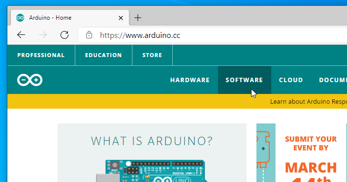
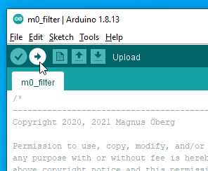
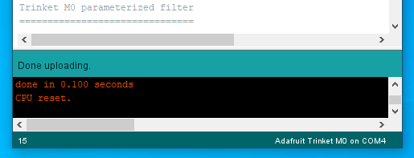

Install guide for the Arduino environment
===
Written by SA5MOG, Magnus Öberg. 2020-02-08

Step by step instructions
--

First thing is to install the Arduino development software on your PC.
This guide is written as step by step instruction for Windows, but the Arduino environment is also available on Linux and Mac OS X.

Linux and Mac installation of the base Arduino development software is not covered by this document. Linux distributions have different packet management and routines, and the built in version may be too old and a manual installation will be needed. The installation instructions for the DotStar library and the Adafruit board support are however the same for all platforms.

You will need a recent version of the Arduino software, version 1.8 or later.

Note that you only need the Arduino software to program your Trinket M0.
 **You do not need to buy an Arduino board.**

If you do not alreay have the software, please point your web browser to **arduino.cc**

Select **Software** menu and **Downloads**

Find the variant for your operating system and click the link

Contribute with money or click **Just download**

When the file is downloaded, select **Open file**, or go to your Download folder and double click on the newly downloaded file.

Allow the app to make changes to your device. Click **yes** in the *User Account Control* popup.

Agree to the GNU Lesser General Public License.

The selected components are OK, click **Next &gt;**

You have the possibility to change the installation folder.
The default is OK for most cases, click **Install**

The installation may take a few minutes, please be patient.

You may get a popup with a question about installing device software: *Adafruit Industries LLC Ports*. Keep the checkbox checked to *Always trust software from "Adafruit Industries"*. Click **Install**

Also install the *Arduino USB Driver* if asked, and trust software from *Arduino srl*. Click **Install**

You may get the question to install the USB Driver one more time. That is not a failure, just click **Install**

When complete, click **Close**

You should have a new icon on the desktop named *Arduino*. It is also added to the start menu. Open it by double click on the icon or go via the start menu.

First time you start you need to allow the *Java(TM) Platform SE* binary to access the internet via the windows firewall. Click *Allow access*

You will get an example sketch loaded in the editor.

To get support for the Adafruit Trinket M0, some additional plugins are needed.

**The following steps are also valid for Linux and Mac OS X!**

Click the *Tools* menu and on *Manage Libraries...*

Enter in the search box: **dotstar led**

You should get a match for *Adafruit DotStar* library, click **Install** 

When it is installed and done, click **Close**

You need to add board support for the Trinket M0. In the *File* menu, click on *Preferences*

In the lower part of that window, you have a text box for *Additional Boards Manager URLs*

Put this exact URL into that text box: 
https://adafruit.github.io/arduino-board-index/package_adafruit_index.json

Click **OK**

Go to the *Tools* menu and to *Board: Arduino Uno*. This may be something else but it is the item that begins with *Board:*

A list with different boards is shown, and at the top: *Boards Manager...* select it.

The boards manager window opens. Enter in the search text field: **trinket m0**

You should see a board package named *Adafruit SAMD Boards*, click on **Install** for it.

This will download support software for the Trinket M0 and other boards. This might take a while downloading and installing. Please be patient.

When it is done, click **Close**

You need to select the Trinket M0 board.
Go to *Tools* and the item starting with *Board:*

This time you will see that there is a *Adafruit SAMD* category, find the *Adafruit Trinket M0* in the list and click on it.

The Arduino environment is now ready for Trinket M0 programming!

Plug in your Trinket M0 via a micro-USB cable.

You should have got a specific port for this USB device. Go to *Tools* and *Port* and select the COM device.

On my system it showed up as *COM3* but it may be different on your machine. (Linux has a different naming of ports, for example: */dev/ttyACM0*)

The current board and port is always shown in the lower right corner.

Now it is time to get the filter program. Enter this exact URL into your browser: 
https://raw.githubusercontent.com/moggen/m0_filter/main/m0_filter.ino

You can see the source code for the filter here. Right-click and select *Save As* or *Save Page As* or similar to save the contents to a file on your harddrive.

You can store the file where you like, but a tip for Windows is to write the file to the *Documents\Arduino* folder. 

**Important**: Make sure you save the file named as *m0_filter.ino* WITHOUT the extra *.txt* at the end that may be automatically added.

Go back to the Arduino window and select *File* and *Open*.
Find the folder that you saved the code in (*Documents\Arduino*).
Select *m0_filter.ino* and click **Open**

A question will pop up if the file should be moved into a sketch folder. Click **OK** here

The program is now loaded into a new Arduino editor window.

Press the circular icon in the upper part of the window with a right pointing arrow, this is the upload function. It will compile and upload the code to the Trinket M0 hardware.

If the upload is stuck or times out, you can click once on the little reset button on the Trinket board and try to upload the program again. Pulling out the USB cable and putting it back again may also do the trick.

It is also possible that the board changes ports, especially after the reset button is pressed.
Check the *Tools* and *Port:* if it has detected the trinket on another port, select it and try again.

When you get the *Done uploading* status message, everything is set and the Trinket is running the program.

Connect your audio source and turn the potentiometers to explore the filter function!

The USB cable does not need to be connected any more if you power the Trinket with some external power source like batteries.

*73 and have fun!*
